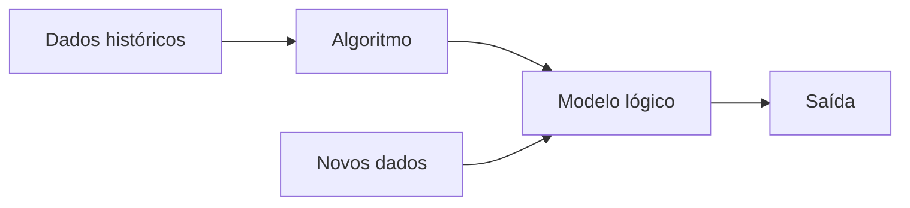

# Aprendizado de maquina

Compilado de material sobre aprendizado de maquina.

**AVISO**: Esta página esta em construção!

Objetivos:
``` 
>> Reunir conceitos e exemplos de aprendizado de máquina para serem usados em sala de aula.
>> Quando possível utilizar exemplos na linguagem python ou outras referências externas.
```

Observações:
```
1. Este material pode ser usado como suporte às disciplinas de: lógica, algoritmos, programação 
e projeto de sistemas.
2. Este material foi ou poderá ser usado em sala de aula/laboratório/EAD.
3. Os exemplos estão em python 3.
4. Esta página poderá passar por atualizações sem aviso prévio.
5. Se houver necessidade do uso de outras ferramentas de desenvolvimento de software além de 
python, consulte a lista de ferramentas:
https://github.com/monteiro74/lista_de_ferramentas
6. Este material é resumido e supõe que o leitor tem conhecimento básico
de programação, estatística e/ou pelo menos português estruturado.
```

## Sumário


- [Aprendizado de maquina](#aprendizado-de-maquina)
  - [Sumário](#sumário)
- [1. Definições](#1-definições)
  - [1.1. Etapas de um projeto de aprendizado de máquina](#11-etapas-de-um-projeto-de-aprendizado-de-máquina)
    - [1.1.1. Organização e preparação de dados](#111-organização-e-preparação-de-dados)
  - [1.2.  O aprendizado de máquina esta dividido em grandes áreas](#12--o-aprendizado-de-máquina-esta-dividido-em-grandes-áreas)
  - [1.3. Exemplos de alguns algoritmos](#13-exemplos-de-alguns-algoritmos)
  - [1.3.1. Supervised](#131-supervised)
    - [1.3.2. Unsupervised](#132-unsupervised)
    - [1.3.3. Reinforcement](#133-reinforcement)
    - [1.3.4. Semi supervised](#134-semi-supervised)
    - [1.3.5. Neural network](#135-neural-network)
  - [1.4. Reconhecimento de padrões em imagens](#14-reconhecimento-de-padrões-em-imagens)
  - [1.5. Algoritmos para reconhecimento de faces](#15-algoritmos-para-reconhecimento-de-faces)
  - [1.6. Algoritmos para reconhecimento de ruas](#16-algoritmos-para-reconhecimento-de-ruas)
  - [1.7. Algortimos usados na agricultura](#17-algortimos-usados-na-agricultura)
- [2. Aprendizado de máquina supervisionado](#2-aprendizado-de-máquina-supervisionado)
  - [2.1. As etapas envolvidas do aprendizado supervisionado](#21-as-etapas-envolvidas-do-aprendizado-supervisionado)
  - [2.2. Tipos de algoritmos de aprendizado supervisionado](#22-tipos-de-algoritmos-de-aprendizado-supervisionado)
    - [2.2.1. Regressão](#221-regressão)
      - [2.2.1.1. Árvore de regressão](#2211-árvore-de-regressão)
      - [2.2.1.2. Regressão Linear](#2212-regressão-linear)
      - [2.2.1.3. Regressão polinomial](#2213-regressão-polinomial)
      - [2.2.1.4. Logistic Regression](#2214-logistic-regression)
      - [2.2.1.5. Support Vector Regression (SVR)](#2215-support-vector-regression-svr)
      - [2.2.1.6. Back propagation neural network classification](#2216-back-propagation-neural-network-classification)
      - [2.2.1.7. Ordinary Least Squares Regression (OLSR)](#2217-ordinary-least-squares-regression-olsr)
    - [2.2.2. Classificação](#222-classificação)
      - [2.2.2.2. Logistic Regression](#2222-logistic-regression)
      - [2.2.2.7. Similarity learning](#2227-similarity-learning)
- [3. Aprendizado de máquina não supervisionado](#3-aprendizado-de-máquina-não-supervisionado)
  - [3.1. Tipos de algoritmos de aprendizado não supervisionado](#31-tipos-de-algoritmos-de-aprendizado-não-supervisionado)
    - [3.1.1. Clustering](#311-clustering)
    - [3.1.2. Associação](#312-associação)
- [4. Aprendizagem por reforço (reinforcement learning, RL)](#4-aprendizagem-por-reforço-reinforcement-learning-rl)
- [+ Referências](#-referências)
- [Avisos, licença, observações, estatísticas](#avisos-licença-observações-estatísticas)
  - [Aviso](#aviso)
  - [Licença](#licença)
  - [Observação](#observação)
  - [Estatísticas](#estatísticas)


---
# 1. Definições

Aprendizado de máquina é uma área dentro da inteligência artificial. A primeira pessoa a cunhar o termo "machine learning" foi Arthur Samuel[^1] em 1959. O aprendizado de máquina construoi modelos de predição, aprendendo através de dados preexistente e prediz a saída de novos dados. A quantidade de entrada usada como entrada esta relacionado com a acurácia da predição de saída do modelo.

[^1]: Samuel, A. L. (1959). [Some studies in machine learning using the game of checkers](https://www.semanticscholar.org/paper/Some-Studies-in-Machine-Learning-Using-the-Game-of-Samuel/e9e6bb5f2a04ae30d8ecc9287f8b702eedd7b772?p2df). IBM Journal of research and development, 3(3), 210-229.





## 1.1. Etapas de um projeto de aprendizado de máquina

| Etapa | Descrição |
| --- | --- |
|1. Obter dados | Consistem em identificar e obter dados relacionados ao problema. Listar diferentes fontes de dados como: arquivos, bancos de dados, API, etc. Coletar os dados. Juntar os dados em um dataset.
|2. Preparar dados | Consistem em colocar os dados em um único local que possa ser usado pelos algoritmos. É identificado o formato e a qualidade dos dados. 
|3. Organização e preparação de dados | Nesta etapa são realizadas a limpeza e conversão de tipos de dados no formato e tipo final de utilização pela utilização de vários filtros. São identificados dados faltantes, duplicados, inválidos e ruído. Este processo esta relacionado com a qualidade final do que vai ser trabalhado e afeta o resultado final. |
|4. Análise de dados | Nesta etapa é feita a seleção da técnica de análise onde o algoritmo de aprendizado de máquina é selecionado.|
|5. Treinamento do modelo | O modelo é treinado via datasets voltados para o treinamento, são observadas padrões, regras, tempo de processamento e saídas.|
|6. Teste do modelo | Após o treinamento o modelo recebem um dataset de treinamento.  |
|7. Implementação | O modelo é finalmente testado com dados do mundo real. |
   

### 1.1.1. Organização e preparação de dados


As sub etapas são:

* Importar o dataset
* Encontrar dados ausentes
* Dividir o dataset em treinamento e teste
  

Exemplo de importação de dados usando python:
As bibliotecas no python são importadas assim:
```python
import numpy as nm
import matplotlib.pyplot as mpt
import pandas as pd
```

Os dataset (ds) geralmente estão no formato CSV e podem ser lidos com o seguinte comando:

```python
ds = pd.read_csv('dataset.csv')
```

## 1.2.  O aprendizado de máquina esta dividido em grandes áreas


| Categoria | Breve descrição | Objetivo |
| --- | --- | --- |
| Supervised (supervisionado) | Algoritmos supervisionados são treinados com um conjunto de dados rotulado, onde as entradas e as saídas desejadas já são conhecidas. | O objetivo é aprender a relação entre as entradas e as saídas, de modo que o modelo possa generalizar para novos dados não rotulados e fazer previsões ou classificações. |
| Unsupervised (Não supervisionado) | Algoritmos não supervisionados são aplicados a conjuntos de dados sem rótulos. O sistema tenta aprender padrões e estruturas subjacentes nos dados por conta própria. | A principal finalidade é explorar a estrutura intrínseca dos dados, como agrupamentos (clustering) ou a redução de dimensionalidade. |
| Reinforcement (Reforço) | Algoritmos de reforço envolvem um agente que toma ações em um ambiente para maximizar uma recompensa acumulada ao longo do tempo. | O agente aprende a associar ações com recompensas, aprendendo assim uma política de ação que otimiza seu desempenho no ambiente. |
| Semi-supervised (Semi-supervisionado) | Algoritmos semi-supervisionados utilizam conjuntos de dados que contêm tanto exemplos rotulados quanto não rotulados. | A ideia é combinar o benefício do aprendizado supervisionado com a capacidade de generalização proporcionada pelos dados não rotulados, especialmente quando rotular grandes conjuntos de dados é caro ou demorado. |
| Neural Networks (Redes Neurais) | As redes neurais são um modelo de aprendizado de máquina inspirado no funcionamento do cérebro humano. Consistem em camadas de unidades (neurônios) conectadas, com cada conexão atribuída a um peso. | Essas redes são capazes de aprender representações complexas e abstratas dos dados, sendo especialmente eficazes em tarefas como reconhecimento de padrões, processamento de linguagem natural e visão computacional. Deep Learning é frequentemente associado a redes neurais com várias camadas (redes neurais profundas). |

Fonte: OpenAI. "GPT-3: Language Models for Few-Shot Learning." OpenAI, 2020. https://www.openai.com/research/gpt-3.

## 1.3. Exemplos de alguns algoritmos

## 1.3.1. Supervised


| Id | Categoria | Subcategoria  | Algoritmo |
| --- |--- | --- | --- |
| 1 | Supervised | Classification | Naive Bayes  |
| 2 | Supervised | Classification | Logistic Regression |
| 3 | Supervised | Classification | K-nearest neighbors classification (KNN)  |
| 4 | Supervised | Classification | Extreme Gradient Boosting (XGBoost)  |
| 5 | Supervised | Classification | Gradient Boosted Trees |
| 6 | Supervised | Classification | Adaptative Boosting (AdaBoosting) |
| 7 | Supervised | Classification | Random Forest Classification |
| 8 | Supervised | Classification | Decision Tree Classification (CART) |
| 9 | Supervised | Classification | Máquinas de Aprendizado Extremo (ELM) |
| 10 | Supervised | Classification | Perceptron |
| 11 | Supervised | Classification | Classificação quadrática |
| 12 | Supervised | Classification | Classificadores Bayesianos Generalizados (GBM) |
| 13 | Supervised | Classification | Classificadores Baseados em Instância |
| 14 | Supervised | Classification | Classificadores Genéticos |
| 15 | Supervised | Classification | Support Vector Machines (SVM) |
| 16 | Supervised | Classification | Similarity Learning  |
| 17 | Supervised | Regression | Linear Regression  |
| 18 | Supervised | Regression | K-Nearest Neighbors Regression (KNN) |
| 19 | Supervised | Regression | Randon Forest Regression |
| 20 | Supervised | Regression | Decision Tree Regression (CART) |
| 21 | Supervised | Regression | Support Vector Regressions (SVR) |
| 22 | Supervised | Regression | Locally Weighted Scatterplot Smoothing (LOWESS) |
| 23 | Supervised | Regression | Regressão Ridge |
| 24 | Supervised | Regression | Regressão Lasso |
| 25 | Supervised | Regression | Regressão Elastic Net |
| 26 | Supervised | Regression | Regressão de Poisson |
| 27 | Supervised | Regression | Regressão de Huber |
| 28 | Supervised | Regression | Regressão dos Mínimos Quadrados Parciais (PLS) |
| 29 | Supervised | Regression | Regressão Beta |
| 30 | Supervised | Regression | Regressão Quantílica |
| 31 | Supervised | Regression | Regressão Polinomial |
| 32 | Supervised | Regression | Regressão de Mínimos Quadrados Penalizados |
| 33 | Supervised | Regression | Multivariate Adaptative Regression Splines (MARS) |
| 34 | Supervised | Dimensionality Reduction | Linear Discriminant Analysis (LDA) |

### 1.3.2. Unsupervised

| Id | Categoria | Subcategoria  | Algoritmo |
| --- |--- | --- | --- |
| 35 | Unsupervised | Association | Apriori | 
| 36 | Unsupervised | Association | Algoritmo FARM (Mineração de Regras de Associação Flexíveis) |
| 37 | Unsupervised | Association | Algoritmo Baseado em Borda (Border Min) |
| 38 | Unsupervised | Association | Algoritmo CPAR (Mineração de Regras de Associação Condicional Compacta) |
| 39 | Unsupervised | Association | Algoritmo de Mineração de Regras de Associação Sequencial (SARMA) |
| 40 | Unsupervised | Association | Algoritmo de Mineração de Associação de Top-K |
| 41 | Unsupervised | Association | Algoritmo de Mineração de Associação por Histograma (MBA-Histogram) |
| 42 | Unsupervised | Association | MINEpi (Mineração de Associação Epidemiológica) |
| 43 | Unsupervised | Association | Algoritmo E-RMiner |
| 44 | Unsupervised | Association | FP-Growth |
| 45 | Unsupervised | Association | Eclat |
| 46 | Unsupervised | Association | Algoritmo de Agrupamento de Estilo de Vida (LCA - Lifestyle Clustering Algorithm) |
| 47 | Unsupervised | Association | C-MAR (Mineração de Regras de Associação Condicional) |
| 48 | Unsupervised | Association | Algoritmo de Mineração de Associação por Consolidação de Conhecimento (CARMAC) |
| 49 | Unsupervised | Clustering | K-MEANS |
| 50 | Unsupervised | Clustering | Gaussian Mixture Models (GMM) |
| 51 | Unsupervised | Clustering | Hierarchical Aglomerative Clustering (HAC) |
| 52 | Unsupervised | Clustering | Density-based Spatial Clustering of Applications with Noise (DBSCAN) |
| 53 | Unsupervised | Clustering | Mean Shift |
| 54 | Unsupervised | Clustering | Agglomerative Clustering |
| 55 | Unsupervised | Clustering | OPTICS (Ordering Points To Identify Clustering Structure) |
| 56 | Unsupervised | Clustering | Spectral Clustering |
| 57 | Unsupervised | Clustering | BIRCH (Balanced Iterative Reducing and Clustering using Hierarchies) |
| 58 | Unsupervised | Clustering | K-Means++ |
| 59 | Unsupervised | Clustering | Affinity Propagation |
| 60 | Unsupervised | Clustering | C-Means (Fuzzy Clustering) |
| 61 | Unsupervised | Clustering | CLARANS (Clustering Large Applications based on RANdomized Search) |
| 62 | Unsupervised | Clustering | Fuzzy C-Means |
| 63 | Unsupervised | Clustering | Self-Organizing Maps (SOM) |
| 64 | Unsupervised | Clustering | Local outlier factor |
| 65 | Unsupervised | Dimensionality Reduction | Locally Linear Embeding (LLE) |
| 66 | Unsupervised | Dimensionality Reduction | t-Distributed Stochastic Nighbor Embedding (b-SNE) |
| 67 | Unsupervised | Dimensionality Reduction | Isomap Embedding |
| 68 | Unsupervised | Dimensionality Reduction | Isomap (Isometric Mapping) |
| 69 | Unsupervised | Dimensionality Reduction | Multidimensional Scaling (MDS) |
| 70 | Unsupervised | Dimensionality Reduction | Principal Component Analysis (PCA) |
| 71 | Unsupervised | Dimensionality Reduction | Uniform Manifold Approximation and Projection (UMAP) |
| 72 | Unsupervised | Dimensionality Reduction | Autoencoders |
| 73 | Unsupervised | Dimensionality Reduction | Linear Discriminant Analysis (LDA) |
| 74 | Unsupervised | Dimensionality Reduction | Kernel PCA |
| 75 | Unsupervised | Dimensionality Reduction | Locally Linear Embedding (LLE) | 
| 76 | Unsupervised | Dimensionality Reduction | Sparse Principal Component Analysis (Sparse PCA)|
| 77 | Unsupervised | Dimensionality Reduction | Independent Component Analysis (ICA) |
| 78 | Unsupervised | Dimensionality Reduction | Factor Analysis |
| 79 | Unsupervised | Dimensionality Reduction | Non-Negative Matrix Factorization (NMF) |
| 80 | Unsupervised | Dimensionality Reduction | Curse of Dimensionality Reduction (CoDReD) |
| 81 | Unsupervised | Dimensionality Reduction | Principal Curves |
| 82 | Unsupervised | Dimensionality Reduction | Linear Autoencoder |

### 1.3.3. Reinforcement

| Id | Categoria | Subcategoria  | Algoritmo |
| --- |--- | --- | --- |
| 83 | Reinforcement | Policy-based methods | Proximal Policy Optimization (PPO) |
| 84 | Reinforcement | Policy-based methods | Deep Deterministic Policy Gradient (DDPG) |
| 85 | Reinforcement | Policy-based methods | Policy Gradient (Reinforce) |
| 86 | Reinforcement | Policy-based methods | Twin Delayed DDPG (TD3) |
| 87 | Reinforcement | Policy-based methods | Actor-Critic Methods |
| 88 | Reinforcement | Policy-based methods | Soft Actor-Critic (SAC) |
| 89 | Reinforcement | Policy-based methods | Deep Q-Network (DQN) |
| 90 | Reinforcement | Policy-based methods | Double DQN (DDQN) |
| 91 | Reinforcement | Policy-based methods | Hindsight Experience Replay (HER) |
| 92 | Reinforcement | Policy-based methods | C51 (Categorical DQN) |
| 93 | Reinforcement | Policy-based methods | Policy Iteration (PI) |
| 94 | Reinforcement | Policy-based methods | Q-Learning |
| 95 | Reinforcement | Policy-based methods | Monte Carlo Methods |
| 96 | Reinforcement | Policy-based methods | Upper Confidence Bound (UCB) for Reinforcement Learning |
| 97 | Reinforcement | Policy-based methods | Deep Q-Learning from Demonstrations (DQfD) |
| 98 | Reinforcement | Policy-based methods | Stochastic Policy Optimization with Path Integrals (TRPO-SN) |
| 99 | Reinforcement | Value-based methods  | Deep Q Neural Network (DQN) |
| 100 | Reinforcement | Value-based methods  | State-Action-Rewards-State-Action (SARSA) |
| 101 | Reinforcement | Value-based methods  | Double DQN (DDQN) |
| 102 | Reinforcement | Value-based methods  | Dueling DQN |
| 103 | Reinforcement | Value-based methods  | Q-Learning |
| 104 | Reinforcement | Value-based methods  | A3C (Asynchronous Advantage Actor-Critic) |
| 105 | Reinforcement | Value-based methods  | C51 (Categorical DQN) |
| 106 | Reinforcement | Value-based methods  | QR-DQN (Quantile Regression DQN) |
| 107 | Reinforcement | Value-based methods  | Rainbow |
| 108 | Reinforcement | Value-based methods  | Policy Iteration (PI) |
| 109 | Reinforcement | Value-based methods  | Upper Confidence Bound (UCB) for Reinforcement Learning |
| 110 | Reinforcement | Value-based methods  | Deep Deterministic Policy Gradient (DDPG) |
| 111 | Reinforcement | Value-based methods  | TRPO (Trust Region Policy Optimization) |
| 112 | Reinforcement | Value-based methods  | PPO (Proximal Policy Optimization) |
| 113 | Reinforcement | Value-based methods  | MADDPG (Multi-Agent Deep Deterministic Policy Gradients) |

### 1.3.4. Semi supervised

| Id | Categoria | Subcategoria  | Algoritmo |
| --- |--- | --- | --- |
| 114 | Semi supervised | Label propagation | |
| 115 | Semi supervised | Label spreading | |
| 116 | Semi supervised | Self training classifier | |
| 117 | Semi supervised | Co-Training ||
| 118 | Semi supervised | Multi-View Learning ||
| 119 | Semi supervised | Tri-Training ||
| 120 | Semi supervised | Spectral Clustering  ||
| 121 | Semi supervised | Generative Adversarial Networks (GANs) ||
| 122 | Semi supervised | VAT (Virtual Adversarial Training) ||
| 123 | Semi supervised | Pseudo-Labeling ||
| 124 | Semi supervised | Mean Teacher ||
| 125 | Semi supervised | MentorNet ||
| 126 | Semi supervised | SSL with Graph Neural Networks ||
| 127 | Semi supervised | FixMatch ||
| 128 | Semi supervised | Semi-Supervised SVM (S3VM) ||
| 129 | Semi supervised | Deep Co-Training ||


### 1.3.5. Neural network

| Id | Categoria | Subcategoria  | Algoritmo |
| --- |--- | --- | --- |
| 130 | Neural networks | Auto encoders | Sparse Auto Encoder (SAE)  |
| 131 | Neural networks | Auto encoders | Denoising Auto Encoder (DAE) |
| 132 | Neural networks | Auto encoders | Variational auto Encoder (VAE)  |
| 133 | Neural networks | Auto encoders | Undercomplete Auto Encoder (AE)  |
| 134 | Neural networks | Auto encoders | Vanilla Autoencoder |
| 134 | Neural networks | Auto encoders | Contractive Autoencoder |
| 136 | Neural networks | Auto encoders | Stacked Autoencoders |
| 137 | Neural networks | Auto encoders | Adversarial Autoencoder (AAE) |
| 138 | Neural networks | Auto encoders | Conditional Variational Autoencoder (CVAE) |
| 139 | Neural networks | Auto encoders | Sequence-to-Sequence Autoencoder |
| 140 | Neural networks | Auto encoders | Variational Recurrent Autoencoder (VRAE) |
| 141 | Neural networks | Auto encoders | Helical Autoencoder |
| 142 | Neural networks | Auto encoders | Factored Variational Autoencoder (FVAE) |
| 143 | Neural networks | Auto encoders | Sparse Variational Autoencoder (SparseVAE) |
| 144 | Neural networks | Auto encoders | Bayesian Variational Autoencoder (BVAE) |
| 145 | Neural networks | Auto encoders | Sliced Wasserstein Autoencoder (SWAE) |
| 146 | Neural networks | Recurrent Neural Networks | Long Short Term memory (LSTM)   |
| 147 | Neural networks | Recurrent Neural Networks | Recurrent Neural Network (RNN)  |
| 148 | Neural networks | Recurrent Neural Networks | Recurrent Independent Mechanisms (RIM) |
| 149 | Neural networks | Recurrent Neural Networks | Gated Reccurent Unit (GRU) |
| 150 | Neural networks | Recurrent Neural Networks | Vanilla RNN (Recurrent Neural Network) |
| 151 | Neural networks | Recurrent Neural Networks | Bidirectional RNN |
| 152 | Neural networks | Recurrent Neural Networks | Echo State Network (ESN) |
| 153 | Neural networks | Recurrent Neural Networks | Attention Mechanism |
| 154 | Neural networks | Recurrent Neural Networks | Neural Turing Machine (NTM) |
| 155 | Neural networks | Recurrent Neural Networks | Clockwork RNN |
| 156 | Neural networks | Recurrent Neural Networks | Reservoir Computing |
| 157 | Neural networks | Recurrent Neural Networks | Hierarchical RNN |
| 158 | Neural networks | Recurrent Neural Networks | Sparse Temporal Gating |
| 159 | Neural networks | Recurrent Neural Networks | Dilated RNN |
| 160 | Neural networks | Recurrent Neural Networks | Grid LSTM |
| 161 | Neural networks | Recurrent Neural Networks | Clockwork Highway Networks |
| 162 | Neural networks | Feed Fordward Neural Networks | Feed Forward (FF)  |
| 163 | Neural networks | Feed Fordward Neural Networks | Deep Feed Forward (DFF) |
| 164 | Neural networks | Feed Fordward Neural Networks | Multilayer Perceptron (MLP) |
| 165 | Neural networks | Feed Fordward Neural Networks | Backpropagation |
| 166 | Neural networks | Feed Fordward Neural Networks | Batch Normalization |
| 167 | Neural networks | Feed Fordward Neural Networks | Dropout |
| 168 | Neural networks | Feed Fordward Neural Networks | Weight Initialization Techniques |
| 169 | Neural networks | Feed Fordward Neural Networks | Rectified Linear Unit (ReLU) |
| 170 | Neural networks | Feed Fordward Neural Networks | Sigmoid Activation Function |
| 171 | Neural networks | Feed Fordward Neural Networks | Hyperbolic Tangent (Tanh) Activation Function |
| 172 | Neural networks | Feed Fordward Neural Networks | Exponential Linear Unit (ELU) |
| 173 | Neural networks | Feed Fordward Neural Networks | Scaled Exponential Linear Unit (SELU) |
| 174 | Neural networks | Feed Fordward Neural Networks | Swish Activation Function |
| 175 | Neural networks | Feed Fordward Neural Networks | Adaptive Learning Rate Methods |
| 176 | Neural networks | Feed Fordward Neural Networks | Residual Networks (ResNet) |
| 177 | Neural networks | Feed Fordward Neural Networks | Inception Networks (GoogLeNet) |
| 178 | Neural networks | Feed Fordward Neural Networks | Batch Size and Learning Rate Tuning |
| 179 | Neural networks | Feed Fordward Neural Networks | Self-Organizing Maps (SOM) |
| 180 | Neural networks | Convolutional Neural Networks | Transposed Convolutional Network |
| 181 | Neural networks | Convolutional Neural Networks | Deep Convolutional Network (DCN) |
| 182 | Neural networks | Convolutional Neural Networks | LeNet-5 |
| 183 | Neural networks | Convolutional Neural Networks | AlexNet |
| 184 | Neural networks | Convolutional Neural Networks | VGGNet |
| 185 | Neural networks | Convolutional Neural Networks | GoogLeNet (Inception) |
| 186 | Neural networks | Convolutional Neural Networks | ResNet (Residual Network) |
| 187 | Neural networks | Convolutional Neural Networks | DenseNet (Densely Connected Convolutional Networks) |
| 188 | Neural networks | Convolutional Neural Networks | MobileNet |
| 189 | Neural networks | Convolutional Neural Networks | ShuffleNet |
| 190 | Neural networks | Convolutional Neural Networks | Xception (Extreme Inception) |
| 191 | Neural networks | Convolutional Neural Networks | Capsule Networks (CapsNets) |
| 192 | Neural networks | Convolutional Neural Networks | SqueezeNet |
| 193 | Neural networks | Convolutional Neural Networks | SENet (Squeeze-and-Excitation Networks) |
| 194 | Neural networks | Convolutional Neural Networks | PNASNet (Progressive Neural Architecture Search) |
| 195 | Neural networks | Convolutional Neural Networks | EfficientNet |
| 196 | Neural networks | Convolutional Neural Networks | Capsule Routing by Agreement (Dynamic Routing Between Capsules) |
| 197 | Neural networks | Convolutional Neural Networks | GCN (Global Context Network) |
| 198 | Neural networks | Convolutional Neural Networks | Spatial Transformer Networks (STN) |
| 199 | Neural networks | Convolutional Neural Networks | PointNet |
| 200 | Neural networks | Convolutional Neural Networks | DeepLab |
| 201 | Neural networks | Convolutional Neural Networks | YOLO (You Only Look Once) |
| 202 | Neural networks | Generative Adversarial Networks | Deep Convolutional GAN (DCGAN) |
| 203 | Neural networks | Generative Adversarial Networks | Cycle GAN |
| 204 | Neural networks | Generative Adversarial Networks | Wasserstein GAN (WGAN) |
| 205 | Neural networks | Generative Adversarial Networks | WGAN-GP (Wasserstein GAN with Gradient Penalty) |
| 206 | Neural networks | Generative Adversarial Networks | Generative Adversarial Networks (GAN)|
| 207 | Neural networks | Generative Adversarial Networks | Conditional GAN (cGAN) |
| 208 | Neural networks | Generative Adversarial Networks | Original GAN (Goodfellow et al.) |
| 209 | Neural networks | Generative Adversarial Networks | InfoGAN |
| 210 | Neural networks | Generative Adversarial Networks | Pix2Pix |
| 211 | Neural networks | Generative Adversarial Networks | StarGAN |
| 212 | Neural networks | Generative Adversarial Networks | StyleGAN |
| 213 | Neural networks | Generative Adversarial Networks | StyleGAN2 |
| 214 | Neural networks | Generative Adversarial Networks | BigGAN |
| 215 | Neural networks | Generative Adversarial Networks | Progressive GAN |
| 216 | Neural networks | Generative Adversarial Networks | Self-Attention GAN (SAGAN) |
| 217 | Neural networks | Generative Adversarial Networks | BEGAN (Boundary Equilibrium GAN) |
| 218 | Neural networks | Generative Adversarial Networks | AC-GAN (Auxiliary Classifier GAN) |
| 219 | Neural networks | Generative Adversarial Networks | LSGAN (Least Squares GAN) |
| 220 | Neural networks | Generative Adversarial Networks | VAE-GAN (Variational Autoencoder GAN) |
| 221 | Neural networks | Generative Adversarial Networks | ALI (Adversarially Learned Inference) |
| 222 | Neural networks | Generative Adversarial Networks | SN-GAN (Spectral Normalization GAN) |
| 223 | Others | Probabilistic Graphical Models | Bayesian Belief Networks (BBN) |

Fonte (adaptado de): https://towardsdatascience.com/lowess-regression-in-python-how-to-discover-clear-patterns-in-your-data-f26e523d7a35
Fonte: OpenAI. "GPT-3: Language Models for Few-Shot Learning." OpenAI, 2020. https://www.openai.com/research/gpt-3.

[Volta ao início](#aprendizado-de-maquina)


## 1.4. Reconhecimento de padrões em imagens

Alguns exemplos de algoritmos usados para reconhecimento de imagens:

| Id | Algortimo | Descrição |
| --- | --- |--- |
| 1 | AdaBoost | Algoritmo de aprendizado de máquina que combina classificadores mais fracos para formar um classificador forte, frequentemente usado em detecção de objetos.|
| 2 |Bag of Visual Words (BoVW) | Método que representa uma imagem por meio de um histograma de palavras visuais, utilizado em tarefas como reconhecimento de objetos.|
|3|Canny Edge Detector | Algoritmo clássico para detecção de bordas em imagens, realçando transições abruptas de intensidade. 
|4|Chamfer Matching | Técnica de correspondência de formas baseada na minimização de distâncias entre contornos de objetos. |
|5|Convolutional Neural Networks (CNN) | Redes neurais projetadas para processar dados em grades, especialmente eficazes em tarefas de visão computacional. |
|6|Decision Trees (Árvores de Decisão) | Estrutura de árvore que toma decisões com base em testes nas características dos dados. |
|7|Deep Belief Networks (DBN) | Modelo de rede neural que combina camadas visíveis e ocultas para aprender representações hierárquicas de dados. |
|8|Deep Residual Networks (ResNet) | Arquitetura de rede neural profunda que utiliza blocos residuais para treinar redes mais profundas com maior eficácia. |
|9|Deformable Part Models (DPM) | Modelo de objeto que representa objetos como coleções de partes deformáveis, usado em detecção de objetos. |
|10|Edge Boxes | Método eficiente para geração de caixas delimitadoras em torno de regiões de interesse em imagens. |
|11|Faster R-CNN | Estrutura de rede neural para detecção de objetos que utiliza regiões de interesse (RoI) para melhorar a eficiência. |
|12|Fisher Vector Encoding | Método de representação de imagens baseado em estatísticas de gradientes, amplamente usado em reconhecimento de objetos. |
|13|Gabor Filters | Filtros usados para extrair características texturais de imagens. |
|14|Haar Cascades | Técnica usada para detecção de objetos em imagens, frequentemente empregada em detecção facial. |
|15|Histogram Backprojection| Técnica de correspondência de histograma usada para segmentação de objetos em imagens. |
|16|Histogram of Oriented Gradients (HOG)| Técnica que calcula a distribuição de gradientes nas imagens, frequentemente usada em detecção de objetos. |
|17|Inception (GoogLeNet) | Arquitetura de rede neural profunda conhecida por seu uso eficiente de computação e desempenho em tarefas de classificação de imagens. |
|18|K-Nearest Neighbors (K-NN) | Algoritmo de classificação baseado na proximidade de instâncias vizinhas no espaço de características. |
|19|Local Binary Patterns (LBP)| Descritor que codifica padrões locais de textura em imagens, utilizado em tarefas como reconhecimento facial. |
|20|Mask R-CNN | Extensão do Faster R-CNN que inclui uma camada adicional para segmentação semântica. |
|21|Mean-Shift Clustering | Algoritmo de agrupamento usado em segmentação de imagens, baseado na convergência para modas locais de densidade. |
|22|ORB (Oriented FAST and Rotated BRIEF)| Algoritmo de detecção e descrição de características usado para correspondência de pontos-chave em imagens. |
|23|Principal Component Analysis (PCA) | Algoritmo de redução de dimensionalidade que busca os componentes principais nos dados. |
|24|Random Forests | Conjunto de árvores de decisão que trabalham em conjunto para melhorar a precisão e robustez. |
|25|ResNet (Redes Residuais) | Arquitetura de rede neural que introduz blocos residuais para superar o problema de desvanecimento do gradiente em redes profundas. |
|26|Scale-Invariant Feature Transform (SIFT) | Algoritmo robusto para detecção de pontos-chave e descrição de características, invariante à escala e rotação. |
|27|Siamese Networks | Redes neurais que aprendem a medir a similaridade entre duas imagens, com aplicações em verificação facial e rastreamento de objetos. |
|28|Spatial Transformer Networks (STN) | Módulo de rede neural que permite a transformação espacial adaptativa de imagens, útil em tarefas de variação de pose. |
|29|Support Vector Machines (SVM) | Algoritmo de aprendizado supervisionado usado para classificação e regressão, eficaz para separar dados em classes. |
|30|SURF (Speeded Up Robust Features) | Algoritmo de detecção e descrição de características usado para localizar pontos de interesse em imagens. |
|31|t-SNE (t-Distributed Stochastic Neighbor Embedding) | Algoritmo de redução de dimensionalidade não linear usado para visualização e clusterização de dados. |
|32|U-Net | Arquitetura de rede neural usada em segmentação semântica de imagens, especialmente em tarefas de processamento médico. |
|33|YOLO (You Only Look Once) | Algoritmo de detecção de objetos que divide a imagem em grade e realiza detecção de objetos em uma única passagem. |

Fonte: OpenAI. "GPT-3: Language Models for Few-Shot Learning." OpenAI, 2020. https://www.openai.com/research/gpt-3.

[Volta ao início](#aprendizado-de-maquina)


## 1.5. Algoritmos para reconhecimento de faces

* ArcFace: Uma técnica de treinamento de rede neural que enfatiza a aprendizagem de representações discriminativas para faces.
* DeepFace: Um modelo de aprendizado profundo desenvolvido pelo Facebook para reconhecimento facial, integrando redes neurais profundas.
* DeepFaceLab: Uma ferramenta que utiliza redes GAN (Redes Generativas Adversárias) para realizar a troca de faces em vídeos.
* DeepID: Uma arquitetura de rede neural profunda projetada especificamente para reconhecimento facial.
* DeepID3: Uma versão avançada do DeepID com melhorias na capacidade de discriminação.
* Dlib: Uma biblioteca que oferece ferramentas para detecção facial, bem como reconhecimento facial.
* Eigenfaces: Um método clássico de reconhecimento facial que utiliza a técnica de Análise de Componentes Principais (PCA) para representar imagens faciais.
* FaceNet: Um modelo de rede neural que aprende representações faciais invariantes à variação de pose, iluminação e expressão.
* Fisherfaces: Similar ao método Eigenfaces, mas utiliza a técnica de Análise Discriminante Linear (LDA) para melhorar a separação entre classes.
* InsightFace: Uma estrutura de rede neural projetada para enfrentar desafios específicos no reconhecimento facial, como variações de idade.
* LBPH (Local Binary Pattern Histograms): Uma técnica eficaz para representar texturas locais na imagem facial.
* MTCNN (Multi-task Cascaded Convolutional Networks): Uma rede neural para detecção de rosto, pontos-chave faciais e alinhamento facial.
* OpenCV (Open Source Computer Vision): Uma biblioteca amplamente utilizada que fornece módulos para detecção e reconhecimento facial.
* VGG-Face: Um modelo baseado na arquitetura VGGNet, treinado especificamente para tarefas de reconhecimento facial.
* Viola-Jones Face Detection: Um algoritmo de detecção de rosto baseado em características Haar que é eficiente e rápido.

Fonte: OpenAI. "GPT-3: Language Models for Few-Shot Learning." OpenAI, 2020. https://www.openai.com/research/gpt-3.

[Volta ao início](#aprendizado-de-maquina)

## 1.6. Algoritmos para reconhecimento de ruas

* Canny Edge Detector: Útil para detectar bordas em imagens, o que pode ser aplicado para destacar as bordas das ruas.
* Detecção de Linhas de Vanishing Point: Identifica as linhas que convergem para um ponto de fuga, o que é útil para estimar a geometria das ruas.
* Detecção de Padrões de Tráfego: Algoritmos podem ser projetados para analisar padrões de tráfego, o que indiretamente ajuda na identificação e compreensão de vias urbanas.
* Hough Transform: Pode ser aplicada para detecção de linhas em imagens, auxiliando na identificação das marcações de ruas.
* Mapas Semânticos: Algoritmos podem ser treinados para criar mapas semânticos, identificando e categorizando diferentes elementos urbanos, incluindo ruas.
* Processamento de Vídeo em Tempo Real: Algoritmos podem ser projetados para processar vídeos em tempo real, identificando características dinâmicas das ruas, como pedestres, veículos e fluxo de tráfego.
* R-CNNs (Region-based Convolutional Neural Networks): Estruturas como Faster R-CNN podem ser utilizadas para detectar e delimitar objetos, incluindo elementos das ruas.
* Redes Neurais Convolutivas (CNNs): Redes neurais convolutivas podem ser treinadas para reconhecer características específicas de ruas, como faixas, sinais de trânsito e meio-fios.
* Segmentação de Cores: Técnicas de segmentação podem ser empregadas para identificar áreas de cores específicas associadas ao pavimento das ruas.
* SLAM (Simultaneous Localization and Mapping): Técnicas SLAM são frequentemente aplicadas para mapear e localizar veículos em ambientes urbanos, o que envolve o reconhecimento e modelagem das ruas.
* Transformada de Morfologia Matemática: Pode ser usada para processamento de imagem e operações de morfologia que ajudam na análise de formas e estruturas das ruas.

Fonte: OpenAI. "GPT-3: Language Models for Few-Shot Learning." OpenAI, 2020. https://www.openai.com/research/gpt-3.

[Volta ao início](#aprendizado-de-maquina)


## 1.7. Algortimos usados na agricultura


---
# 2. Aprendizado de máquina supervisionado

Neste tipo de aprendizagem a máquina é treinada usando dados com "rótulos", e a partir destes dados tenta realizar uma predição de saída do processamento. Esses rótulos são descritores, nomes de campos. 

Os modelos são treinados usado dataset com rótulos, onde o modelo aprende com cada tipo de dados que entra no processamento. quando o treinamento finaliza o modelo pode ser testado com dados de teste (que é um sub conjunto dos dados de treinamento) de forma a poder fazer uma predição. 

## 2.1. As etapas envolvidas do aprendizado supervisionado

1 Determinar o tipo de dataset para treinamento <br>
2 Coletar os dados com rótulos <br>
3 Dividir o dataset em 3 partes: <br>
  3.1 Dataset de treinamento <br>
  3.2. Datset de teste <br>
  3.3. Dataset de validação <br>
4 Determinar o algoritmo para o modelo <br>
5 Executar o algoritmo no dataset de treinamento <br>
6 Executar o algoritmo no dataset de teste <br>
7 Executar o algoritmo no dataset de validação <br>

## 2.2. Tipos de algoritmos de aprendizado supervisionado

Estes podem ser divididos em 2 subtipos:

[Volta ao início](#aprendizado-de-maquina)

### 2.2.1. Regressão

São utilizados quando existe alguma combinação, concodância ou relação entre os dados de entrada e de saída. São bastante utilizados para predizer variáveis contínuas (como por exemplo na previsão do tempo/clima). 

Aqui estão **alguns** algoritmos para:

#### 2.2.1.1. Árvore de regressão

É um algoritmo usado para resolver regressão e classificação. o algoritmo utiliza um modelo de árvore para realizar as predições de valores (regressão) ou predizer classes (classificações). 

Exemplo em python:

```python
# -*- coding: utf-8 -*-
"""
@author: https://www.geeksforgeeks.org/python-decision-tree-regression-using-sklearn/
"""

import numpy as np 
import matplotlib.pyplot as plt 
import pandas as pd 

# o dataset é uma tabela carregada em um array com as seguintes colunas:
# coluna 1: produtos (categoria de produtos)
# coluna 2: custo de produção
# coluna 3: lucro
ds = np.array( 
[['Camisa', 100, 1000], 
['Bolsa', 500, 3000], 
['Cinto', 1500, 5000], 
['Calça', 3500, 8000], 
['Vestido', 5000, 6500], 
['Sandalia', 6000, 7000], 
['Boné', 8000, 15000], 
['Meia', 9500, 20000], 
['Relogio', 12000, 21000], 
['Pulseira', 14000, 25000], 
['Oculos', 15500, 27000], 
['Colete', 16500, 30000], 
['Mochila', 25000, 52000], 
['Terno', 30000, 80000] 
]) 
  
# imprime o dataset
print('--- imprime o dataset ----------------------')
print(ds) 

# Seleciona a coluna 2 como tipo int
# atribui toda a coluna 2 a variavel X
X = ds[:, 1:2].astype(int)  
  
# print X 
# imprime a coluna X
print('--- imprime a coluna/eixo X ------------------')
print(X) 

# Seleciona a coluna 2 como tipo int
# atribui toda a coluna 2 a variavel Y
Y = ds[:, 2].astype(int)  
  
# print y
print('--- imprime o linha/eixo y ---------------------------')
print(Y) 

# aciona a bilbioteca de regressao
from sklearn.tree import DecisionTreeRegressor  
  
# cria o objeto regressor
regressor = DecisionTreeRegressor(random_state = 0)  
  
# passa os valores de X e Y para o regressor 
regressor.fit(X, Y) 

# realização a predição para o de custo de produção de 27000
Y_pred = regressor.predict([[27000]]) 
  
# mostra o valor previsto para 27000
print('--- Predição de preço para custo em 27000 ----------------')
print("Predição de preço: % d\n"% Y_pred) 

# prepara o gráfico
# valor mínimo de X e Y de 0.01 
X_grid = np.arange(min(X), max(X), 0.01) 
# transforma a coluna em pontos para o gráfico
X_grid = X_grid.reshape((len(X_grid), 1))  
# carrega o gráfico de dispersão, linha vermelha
plt.scatter(X, Y, color = 'red') 
# plota os dados preditos
plt.plot(X_grid, regressor.predict(X_grid), color = 'blue')  
# atribui o título
plt.title('Lucro p/ custo de produção')
# atribui o eixo X
plt.xlabel('Custo de produção') 
# atribui o eixo Y 
plt.ylabel('Lucro') 
# mostra o gráfico
plt.show() 

```


Fonte: Adaptando do exemplo de: https://www.geeksforgeeks.org/python-decision-tree-regression-using-sklearn/


[Volta ao início](#aprendizado-de-maquina)

#### 2.2.1.2. Regressão Linear

Definição:
```
A análise de regressão linear é usada para prever o valor de uma variável com base no valor 
de outra variável. A variável que você deseja prever é chamada de variável dependente. A 
variável que você está usando para prever o valor da outra variável é 
chamada de variável independente.
Fonte: https://www.ibm.com/topics/linear-regression
```

Exemplo em python:

```python
import matplotlib.pyplot as plt1
from scipy import stats

             # 1  2  3  4  5  6  7  8  9 10
velocidade  = [90,93,80,75,79,83,89,71,95,85]
idade       = [10,9,12,11, 11, 11,11,12,7,9]


slope, intercept, r, p, std_err = stats.linregress(velocidade, idade)

def funcao1(velocidade):
  return slope * velocidade + intercept

modelo1 = list(map(funcao1, velocidade))

# em seguida realizamos as operações
#           eixo-x eixo-y
plt1.scatter(velocidade, idade)
plt1.plot(velocidade, modelo1)
plt1.show()
```


[Volta ao início](#aprendizado-de-maquina)

#### 2.2.1.3. Regressão polinomial

Definição: 
```
A regressão polinomial é uma análise estatística que descreve a variação de uma variável
aleatória explicada a partir de uma função polinomial de uma variável explicativa. Este é
um caso especial de regressão linear múltipla , em que as observações são construídas a
partir dos poderes de uma única variável. 
Fonte: https://pt.frwiki.wiki/wiki/R%C3%A9gression_polynomiale
```


Exemplo em python:

```python
import numpy
import matplotlib.pyplot as plt1

hora = [1,2,3,4,5,6,7,8,9,10,11,12,13,14,15,16,17,18,19,20]             
velocidade  = [90,93,65,65,63,65,67,71,72,71,78,67,70,80,80,64,78,75,90,100]
       
modelo1 = numpy.poly1d(numpy.polyfit(hora, velocidade, 3))
linha1 = numpy.linspace(1, 22, 100)

# em seguida realizamos as operações
plt1.scatter(hora, velocidade)
plt1.plot(linha1, modelo1(linha1))
plt1.show()
```

[Volta ao início](#aprendizado-de-maquina)

#### 2.2.1.4. Logistic Regression

O algoritmo de **regressão logística** é uma **regressão** ou **classificação** ? https://datascience.stackexchange.com/questions/473/is-logistic-regression-actually-a-regression-algorithm


```
Mais detalhes sobre outros algoritmos podem ser encontrados em:
https://www.javatpoint.com/regression-analysis-in-machine-learning
```

[Volta ao início](#aprendizado-de-maquina)

#### 2.2.1.5. Support Vector Regression (SVR)

É uma variação do Support Vector Machine que implementa regressão linear e não linear. Objetivando encontrar uma função para prever o valor de saída de um dado valor de entrada.  Podendo ser usado para predição de séries temporais. 


O exemplo abaixo esta disponível em:
https://scikit-learn.org/stable/auto_examples/svm/plot_svm_regression.html#sphx-glr-auto-examples-svm-plot-svm-regression-py


Traduzindo o exemplo: "Exemplo de brinquedo de regressão 1D usando kernels lineares, polinomiais e RBF".


Exemplo em python

```python
# -*- coding: utf-8 -*-
"""
@author: https://scikit-learn.org/stable/auto_examples/svm/plot_svm_regression.html#sphx-glr-auto-examples-svm-plot-svm-regression-py
"""

import matplotlib.pyplot as plt
import numpy as np

from sklearn.svm import SVR

X = np.sort(5 * np.random.rand(40, 1), axis=0)
y = np.sin(X).ravel()
y[::5] += 3 * (0.5 - np.random.rand(8))

svr_rbf = SVR(kernel="rbf", C=100, gamma=0.1, epsilon=0.1)
svr_lin = SVR(kernel="linear", C=100, gamma="auto")
svr_poly = SVR(kernel="poly", C=100, gamma="auto", degree=3, epsilon=0.1, coef0=1)

lw = 2

svrs = [svr_rbf, svr_lin, svr_poly]
kernel_label = ["RBF", "Linear", "Polynomial"]
model_color = ["m", "c", "g"]

fig, axes = plt.subplots(nrows=1, ncols=3, figsize=(15, 10), sharey=True)
for ix, svr in enumerate(svrs):
    axes[ix].plot(
        X,
        svr.fit(X, y).predict(X),
        color=model_color[ix],
        lw=lw,
        label="{} model".format(kernel_label[ix]),
    )
    axes[ix].scatter(
        X[svr.support_],
        y[svr.support_],
        facecolor="none",
        edgecolor=model_color[ix],
        s=50,
        label="{} support vectors".format(kernel_label[ix]),
    )
    axes[ix].scatter(
        X[np.setdiff1d(np.arange(len(X)), svr.support_)],
        y[np.setdiff1d(np.arange(len(X)), svr.support_)],
        facecolor="none",
        edgecolor="k",
        s=50,
        label="other training data",
    )
    axes[ix].legend(
        loc="upper center",
        bbox_to_anchor=(0.5, 1.1),
        ncol=1,
        fancybox=True,
        shadow=True,
    )

fig.text(0.5, 0.04, "data", ha="center", va="center")
fig.text(0.06, 0.5, "target", ha="center", va="center", rotation="vertical")
fig.suptitle("Support Vector Regression", fontsize=14)
plt.show()
```

[Volta ao início](#aprendizado-de-maquina)

#### 2.2.1.6. Back propagation neural network classification

Este algoritmo pode ser usado tanto para classificação como regressão.

[Volta ao início](#aprendizado-de-maquina)

#### 2.2.1.7. Ordinary Least Squares Regression (OLSR)


```python
# -*- coding: utf-8 -*-
"""
@author: https://scikit-learn.org/stable/auto_examples/linear_model/plot_ols_ridge_variance.html#sphx-glr-auto-examples-linear-model-plot-ols-ridge-variance-py
"""

import matplotlib.pyplot as plt
import numpy as np

from sklearn import linear_model

X_train = np.c_[0.5, 1].T
y_train = [0.5, 1]
X_test = np.c_[0, 2].T

np.random.seed(0)

classifiers = dict(
    ols=linear_model.LinearRegression()
)

for name, clf in classifiers.items():
    fig, ax = plt.subplots(figsize=(4, 3))

    for _ in range(6):
        this_X = 0.1 * np.random.normal(size=(2, 1)) + X_train
        clf.fit(this_X, y_train)

        ax.plot(X_test, clf.predict(X_test), color="gray")
        ax.scatter(this_X, y_train, s=3, c="gray", marker="o", zorder=10)

    clf.fit(X_train, y_train)
    ax.plot(X_test, clf.predict(X_test), linewidth=2, color="blue")
    ax.scatter(X_train, y_train, s=30, c="red", marker="+", zorder=10)

    ax.set_title(name)
    ax.set_xlim(0, 2)
    ax.set_ylim((0, 1.6))
    ax.set_xlabel("X")
    ax.set_ylabel("y")

    fig.tight_layout()

plt.show()
```


[Volta ao início](#aprendizado-de-maquina)


### 2.2.2. Classificação

Na classificação algoritmos são usados quando uma variável é categórica (que pode ser usada em agrupamentos, como exemplo de variáveis categóricas temos: raça, sexo, grupo de idade, nacionalidade, etc). 

Aqui estão **alguns** algoritmos dest tipo:

[Volta ao início](#aprendizado-de-maquina)


#### 2.2.2.2. Logistic Regression

É um algoritmo de aprendizado supervisionado. Usado para tarefas de classificação.

O algoritmo de **regressão logística** é uma **regressão** ou **classificação** ? https://datascience.stackexchange.com/questions/473/is-logistic-regression-actually-a-regression-algorithm

[Volta ao início](#aprendizado-de-maquina)


#### 2.2.2.7. Similarity learning


**Observação:** este algoritmo pode ser usado na regressão e classificação.

[Volta ao início](#aprendizado-de-maquina)


---
# 3. Aprendizado de máquina não supervisionado


No aprendizado de máquina não supervisionado os dataset não tem labels (rótulos).  Neste caso os modelos não são supervisionados durante o treinamento com os datasets. Desta forma os modelos devem eles mesmos achar padrões e tentar descobrrir "labels" nos dados de entrada. O aprendizado de máquina não supervisionado permtie descobrir detalhes do dataset e agrupar os dados de acordo com estes detalhes. 

Por exemplo: Estes algoritmos podem receber um dataset contendo várias imagens de pessoas e carros,  e produzir como resultado dois clustes (agrupamentos) contendo as imagens que identificar como mais similares (um grupo de pessoas e outro de carros), os dados de entrada neste caso não tem "labels", após interpretar e processar a saída são dois novos grupos de imagens.


[Volta ao início](#aprendizado-de-maquina)

## 3.1. Tipos de algoritmos de aprendizado não supervisionado

### 3.1.1. Clustering

É uma forma de agrupamento pela similaridade dos objetos detectados (maior e menor similaridade no outro grupo). Esta técnica detecta semelhanças entre os objetos de dados e organiza em classes (categorias) se estas características estão mais fortes ou fracas nos objetos.

[Volta ao início](#aprendizado-de-maquina)


### 3.1.2. Associação

O objetivo destes algoritmos é detectar as regras de associação entre as variáveis (geralmente em grandes datasets). Estes algoritmos buscas associações frequentes entre os dados, chamadas de regras se-então, descobrindo correlações e ocorrências entre os dados e suas conexções. Um exemplo poderia ser descobrir que quem compra o produto A pode comprar o produto B pela observação do conteúdo de um carrinho de compra. 

[Volta ao início](#aprendizado-de-maquina)


---
# 4. Aprendizagem por reforço (reinforcement learning, RL)

São algoritmos que não entram nenhuma das classificações anteriores. Este tipo de algoritmo requer dados com labels (rótulo) e também classifica os dados de entrada. O resultado é avaliado e é usado para corririr os rumos tomados durante o processamento usando algo como "tentatia e erro" (ou recompensa e penalidade). Os principais elementos deste tipo de sistema de aprendizagem são: um agente, um ambiente e um sinal de recompensa.

* Agente: o agente aprende quais ações deve executar baseado no estado atual e no sinal de recomenpensa que recebe do ambiente.
* Ambiente: o ambiente determina resultado o que o agente realizou e apresenta um feedback (que é o sinal de recompensa).
* Sinal de recompensa: É um valor que reflete o resultado o que o agente realizou.

Alguns exemplos de algoritmos são: 

* Markov decision process (MDP) [^2]
* Bellman equation [^4]
* Dynamic programming
* Value iteration
* Policy iteration [^3]
* Q-learning


[^2]: Reinforcement Learning: Part 2: Markov Decision Process. Jain, Mehul. https://medium.com/@j13mehul/reinforcement-learning-part-2-markov-decision-process-755cf6473d64

[^3]: Reinforcement Learning: Part 10: Policy-Gradient Methods — REINFORCE, Actor-Critic. Jain, Mehul. https://medium.com/@j13mehul/reinforcement-learning-part-10-policy-gradient-methods-reinforce-actor-critic-7973393f8820

[^4]: Reinforcement Learning: Part 3: Bellman Equation. Jain, Mehul. https://medium.com/@j13mehul/reinforcement-learning-part-3-bellman-equation-5e82311df44b

Nos algoritmos "model-based", o agente é capaz de prever a recompensa e decide de forma a otimizar o resultado. É usado em situações onde se detem conhecimento sobre o ambiente e os resultados das ações sobre aquele ambiente.

Nos algoritmos "model-free" os agentes realizam multiplas ações, várias vezes, e apreendem com o resultados destas. Com essa experiência é possível decidir que ações realizar para receber mais recompensas. É usado em ambientes dinâmicos. Um exemplo de uso é embarcado em veículos autônomos. 

Tipos de algoritmos de [RL](https://spinningup.openai.com/en/latest/spinningup/rl_intro2.html). Estes podem ser vistos na figura abaixo:


Fonte da figura: https://spinningup.openai.com/en/latest/spinningup/rl_intro2.html


```
Seção em desenvolvimento
```
[Volta ao início](#aprendizado-de-maquina)

---
# + Referências

Lista de algoritmos 
https://machinelearningmastery.com/a-tour-of-machine-learning-algorithms/


[Volta ao início](#aprendizado-de-maquina)

---
# Avisos, licença, observações, estatísticas


## Aviso
```
Este material esta recebendo atualizações frequentes. 
As informações aqui contidas podem ser alteradas sem aviso prévio.
```

## Licença
```
Organizador: Prof. Dr. Monteiro.
Attribution-NonCommercial-ShareAlike 4.0 International (CC BY-NC-SA 4.0) 
https://creativecommons.org/licenses/by-nc-sa/4.0/
```

## Observação
```
Primeira postagem em: Dezembro/2023.
```


## Estatísticas


Histórico de atualizações nos repositórios do Prof. Monteiro:<br>
[](https://github.com/monteiro74/tutorial_python)

[](https://git.io/streak-stats)

[](https://github.com/monteiro74/github-readme-stats)

Pulse:<br>
https://github.com/monteiro74/tutorial_python/pulse<BR>


Histórico de frequência de código:<BR>
https://github.com/monteiro74/tutorial_python/graphs/code-frequency<BR>

Atividade de commits:<BR>
https://github.com/monteiro74/tutorial_python/graphs/commit-activity<BR>

Trafego:<BR>
https://github.com/monteiro74/tutorial_python/graphs/traffic<BR>


[](https://github.com/monteiro74/github-readme-stats)

[](https://github.com/monteiro74/github-readme-stats)

[Voltar ao sumário](#sumário)<br>

