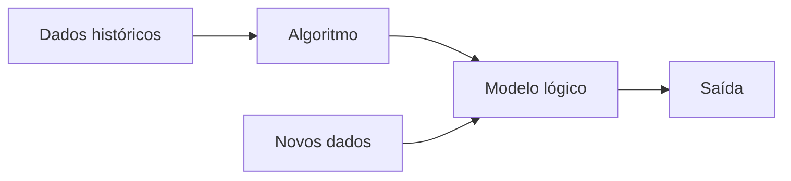

# Aprendizado de maquina
Aprendizado de maquina


- [Aprendizado de maquina](#aprendizado-de-maquina)
- [1. Definições](#1-definições)
  - [1.1. Etapas de um projeto de aprendizado de máquina](#11-etapas-de-um-projeto-de-aprendizado-de-máquina)
    - [1.1.1. Organização e preparação de dados](#111-organização-e-preparação-de-dados)
- [Avisos, licença, observações, estatísticas](#avisos-licença-observações-estatísticas)
  - [Aviso](#aviso)
  - [Licença](#licença)
  - [Observação](#observação)
  - [Estatísticas](#estatísticas)


---
# 1. Definições

Aprendizado de máquina é uma área dentro da inteligência artificial. A primeira pessoa a cunhar o termo "machine learning" foi Arthur Samuel[^1] em 1959. O aprendizado de máquina construoi modelos de predição, aprendendo através de dados preexistente e prediz a saída de novos dados. A quantidade de entrada usada como entrada esta relacionado com a acurácia da predição de saída do modelo.

[^1]: Samuel, A. L. (1959). [Some studies in machine learning using the game of checkers](https://www.semanticscholar.org/paper/Some-Studies-in-Machine-Learning-Using-the-Game-of-Samuel/e9e6bb5f2a04ae30d8ecc9287f8b702eedd7b772?p2df). IBM Journal of research and development, 3(3), 210-229.




O aprendizado de máquina esta dividido em 3 grandes áreas:

1.  Supervised learning (Aprendizagem por reforço)
   1.1. Classificação
   1.2. Regressão
2. Unsupervised learning (Aprendizagem não supervisionada)
  2.1. Clustering (agrupamento)
  2.2. Associação
3. Reinforcement learning (Aprendizagem supervisionada)


## 1.1. Etapas de um projeto de aprendizado de máquina

| Etapa | Descrição |
| --- | --- |
|1. Obter dados | Consistem em identificar e obter dados relacionados ao problema. Listar diferentes fontes de dados como: arquivos, bancos de dados, API, etc. Coletar os dados. Juntar os dados em um dataset.
|2. Preparar dados | Consistem em colocar os dados em um único local que possa ser usado pelos algoritmos. É identificado o formato e a qualidade dos dados. 
|3. Organização e preparação de dados | Nesta etapa são realizadas a limpeza e conversão de tipos de dados no formato e tipo final de utilização pela utilização de vários filtros. São identificados dados faltantes, duplicados, inválidos e ruído. Este processo esta relacionado com a qualidade final do que vai ser trabalhado e afeta o resultado final. |
|4. Análise de dados | Nesta etapa é feita a seleção da técnica de análise onde o algoritmo de aprendizado de máquina é selecionado.|
|5. Treinamento do modelo | O modelo é treinado via datasets voltados para o treinamento, são observadas padrões, regras, tempo de processamento e saídas.|
|6. Teste do modelo | Após o treinamento o modelo recebem um dataset de treinamento.  |
|7. Implementação | O modelo é finalmente testado com dados do mundo real. |
   

### 1.1.1. Organização e preparação de dados


As sub etapas são:

* Importar o dataset
* Encontrar dados ausentes
* Codificar dados de categorização
* Dividir o dataset em treinamento e teste
  

As bibliotecas no python são importadas assim:
```python
import numpy as nm
import matplotlib.pyplot as mpt
import pandas as pd
```

Os dataset (ds) geralmente estão no formato CSV e podem ser lidos com o seguinte comando:

```python
ds = pd.read_csv('dataset.csv')
```


---
# Avisos, licença, observações, estatísticas


## Aviso
```
Este material esta recebendo atualizações frequentes. 
As informações aqui contidas podem ser alteradas sem aviso prévio.
```

## Licença
```
Attribution-NonCommercial-ShareAlike 4.0 International (CC BY-NC-SA 4.0) 
https://creativecommons.org/licenses/by-nc-sa/4.0/
```

## Observação
```
Primeira postagem em: Junho/2023.
```


## Estatísticas


Histórico de atualizações nos repositórios do Prof. Monteiro:<br>
[](https://github.com/monteiro74/tutorial_python)

[](https://git.io/streak-stats)

[](https://github.com/monteiro74/github-readme-stats)

Pulse:<br>
https://github.com/monteiro74/tutorial_python/pulse<BR>


Histórico de frequência de código:<BR>
https://github.com/monteiro74/tutorial_python/graphs/code-frequency<BR>

Atividade de commits:<BR>
https://github.com/monteiro74/tutorial_python/graphs/commit-activity<BR>

Trafego:<BR>
https://github.com/monteiro74/tutorial_python/graphs/traffic<BR>


[](https://github.com/monteiro74/github-readme-stats)

[](https://github.com/monteiro74/github-readme-stats)

[Voltar ao sumário](#sumário)<br>

