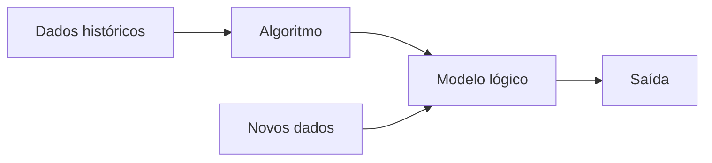

# Aprendizado de maquina
Aprendizado de maquina


```
Objetivos: Pequenos exemplos para uso da linguagem python em sala de aula.
Exemplos que podem ser citados e comentados nas disciplinas que necessitam do apoio
de uma linguagem de programação. Como prerequisito é necessário ter uma IDE instalada.
Este material é extremamente resumido e supõe que o leitor tem conhecimento básico
de programação ou pelo menos português estruturado.
```

```
Observações:
1. Este material pode ser usado como suporte às disciplinas de: lógica,
algoritmos, programação e projeto de sistemas.
2. Este material foi ou poderá ser usado em sala de aula/laboratório/EAD.
3. Os exemplos estão em python 3.
4. Esta página poderá passar por atualizações sem aviso prévio.
5. Se houver necessidade do uso de outras ferramentas de desenvolvimento 
de software além de python, consulte a lista de ferramentas:
https://github.com/monteiro74/lista_de_ferramentas
```

## Sumário

- [Aprendizado de maquina](#aprendizado-de-maquina)
  - [Sumário](#sumário)
- [1. Definições](#1-definições)
  - [1.1. Etapas de um projeto de aprendizado de máquina](#11-etapas-de-um-projeto-de-aprendizado-de-máquina)
    - [1.1.1. Organização e preparação de dados](#111-organização-e-preparação-de-dados)
  - [1.2.  O aprendizado de máquina esta dividido em 3 grandes áreas:](#12--o-aprendizado-de-máquina-esta-dividido-em-3-grandes-áreas)
  - [1.3. Tabela com alguns algoritmos](#13-tabela-com-alguns-algoritmos)
- [2. Aprendizado de máquina supervisionado](#2-aprendizado-de-máquina-supervisionado)
  - [2.1. As etapas envolvidas do aprendizado supervisionado](#21-as-etapas-envolvidas-do-aprendizado-supervisionado)
  - [2.2. Tipos de algoritmos de aprendizado supervisionado](#22-tipos-de-algoritmos-de-aprendizado-supervisionado)
    - [2.2.1. Regressão](#221-regressão)
      - [2.2.1.1. Árvore de regressão](#2211-árvore-de-regressão)
      - [2.2.1.2. Regressão Linear](#2212-regressão-linear)
      - [2.2.1.3. Regressão polinomial](#2213-regressão-polinomial)
      - [2.2.1.4. Logistic Regression](#2214-logistic-regression)
      - [2.2.1.5. Support Vector Regression (SVR)](#2215-support-vector-regression-svr)
      - [2.2.1.6. Back propagation neural network classification](#2216-back-propagation-neural-network-classification)
      - [2.2.1.7. Ordinary Least Squares Regression (OLSR)](#2217-ordinary-least-squares-regression-olsr)
      - [2.2.1.8. Multivariate Adaptive Regression Splines (MARS)](#2218-multivariate-adaptive-regression-splines-mars)
      - [2.2.1.9. Locally Estimated Scatterplot Smoothing (LOESS)](#2219-locally-estimated-scatterplot-smoothing-loess)
    - [2.2.2. Classificação](#222-classificação)
      - [2.2.2.1. Árvore de decisão](#2221-árvore-de-decisão)
      - [2.2.2.2. Logistic Regression](#2222-logistic-regression)
      - [2.2.2.3. Random Forest](#2223-random-forest)
      - [2.2.2.4. SVM (Support Vector Machines)](#2224-svm-support-vector-machines)
      - [2.2.2.5. Naive Bayes](#2225-naive-bayes)
      - [2.2.2.6. K-Nearest Neighbors (KNN)](#2226-k-nearest-neighbors-knn)
      - [2.2.2.7. Similarity learning](#2227-similarity-learning)
      - [2.2.2.8. Gradient Boosting](#2228-gradient-boosting)
- [3. Aprendizado de máquina não supervisionado](#3-aprendizado-de-máquina-não-supervisionado)
  - [3.1. Tipos de algoritmos de aprendizado não supervisionado](#31-tipos-de-algoritmos-de-aprendizado-não-supervisionado)
    - [3.1.1. Clustering](#311-clustering)
      - [3.1.1.1. Anomaly detection](#3111-anomaly-detection)
      - [3.1.1.2. K-Means clustering](#3112-k-means-clustering)
      - [3.1.1.3. Hierarchical clustering](#3113-hierarchical-clustering)
    - [3.1.2. Associação](#312-associação)
      - [3.1.2.1. Apriori algorithm](#3121-apriori-algorithm)
      - [3.1.2.2. Association rule](#3122-association-rule)
      - [3.1.2.3. FP-Growth algorithm](#3123-fp-growth-algorithm)
      - [3.1.2.3. Principle Component Analysis](#3123-principle-component-analysis)
      - [3.1.2.4. Singular value decomposition](#3124-singular-value-decomposition)
- [4. Aprendizagem por reforço (reinforcement learning, RL)](#4-aprendizagem-por-reforço-reinforcement-learning-rl)
- [Referências](#referências)
- [Avisos, licença, observações, estatísticas](#avisos-licença-observações-estatísticas)
  - [Aviso](#aviso)
  - [Licença](#licença)
  - [Observação](#observação)
  - [Estatísticas](#estatísticas)


---
# 1. Definições

Aprendizado de máquina é uma área dentro da inteligência artificial. A primeira pessoa a cunhar o termo "machine learning" foi Arthur Samuel[^1] em 1959. O aprendizado de máquina construoi modelos de predição, aprendendo através de dados preexistente e prediz a saída de novos dados. A quantidade de entrada usada como entrada esta relacionado com a acurácia da predição de saída do modelo.

[^1]: Samuel, A. L. (1959). [Some studies in machine learning using the game of checkers](https://www.semanticscholar.org/paper/Some-Studies-in-Machine-Learning-Using-the-Game-of-Samuel/e9e6bb5f2a04ae30d8ecc9287f8b702eedd7b772?p2df). IBM Journal of research and development, 3(3), 210-229.





## 1.1. Etapas de um projeto de aprendizado de máquina

| Etapa | Descrição |
| --- | --- |
|1. Obter dados | Consistem em identificar e obter dados relacionados ao problema. Listar diferentes fontes de dados como: arquivos, bancos de dados, API, etc. Coletar os dados. Juntar os dados em um dataset.
|2. Preparar dados | Consistem em colocar os dados em um único local que possa ser usado pelos algoritmos. É identificado o formato e a qualidade dos dados. 
|3. Organização e preparação de dados | Nesta etapa são realizadas a limpeza e conversão de tipos de dados no formato e tipo final de utilização pela utilização de vários filtros. São identificados dados faltantes, duplicados, inválidos e ruído. Este processo esta relacionado com a qualidade final do que vai ser trabalhado e afeta o resultado final. |
|4. Análise de dados | Nesta etapa é feita a seleção da técnica de análise onde o algoritmo de aprendizado de máquina é selecionado.|
|5. Treinamento do modelo | O modelo é treinado via datasets voltados para o treinamento, são observadas padrões, regras, tempo de processamento e saídas.|
|6. Teste do modelo | Após o treinamento o modelo recebem um dataset de treinamento.  |
|7. Implementação | O modelo é finalmente testado com dados do mundo real. |
   

### 1.1.1. Organização e preparação de dados


As sub etapas são:

* Importar o dataset
* Encontrar dados ausentes
* Dividir o dataset em treinamento e teste
  

As bibliotecas no python são importadas assim:
```python
import numpy as nm
import matplotlib.pyplot as mpt
import pandas as pd
```

Os dataset (ds) geralmente estão no formato CSV e podem ser lidos com o seguinte comando:

```python
ds = pd.read_csv('dataset.csv')
```

## 1.2.  O aprendizado de máquina esta dividido em 3 grandes áreas:

1.  Supervised learning (Aprendizagem por reforço)
   1.1. Classificação
   1.2. Regressão
2. Unsupervised learning (Aprendizagem não supervisionada)
  2.1. Clustering (agrupamento)
  2.2. Associação
3. Reinforcement learning (Aprendizagem por reforço)


[Volta ao início](#aprendizado-de-maquina)

## 1.3. Tabela com alguns algoritmos

Alguns algoritmos citados neste texto estão categorizados abaixo:

| ID | Tipo | Subtipo | Algoritmo | Observacao |
| --- | ---  | ---     | ---  | ---        |
| 1 | Supervisionado | Regressão | Regression Trees | |
| 2 | Supervisionado | Regressão | Regressão linear | |
| 3 | Supervisionado | Regressão | Regressão polinomial | |
| 4 | Supervisionado | Regressão | Regressão logística | |
| 5 | Supervisionado | Regressão | Support Vector Regression (SVR) | |
| 6 | Supervisionado | Regressão | Back propagation neural network classification | |
| 7 | Supervisionado | Regressão | Ordinary Least Squares Regression (OLSR) | |
| 8 | Supervisionado | Regressão | Multivariate Adaptive Regression Splines (MARS) | |
| 9 | Supervisionado | Regressão | Locally Estimated Scatterplot Smoothing (LOESS) | |
| 10 | Supervisionado | Classificação | Decision tree | |
| 11 | Supervisionado | Classificação | Logistic regression | |
| 12 | Supervisionado | Classificação | Randon forest | |
| 13 | Supervisionado | Classificação | SVM | |
| 14 | Supervisionado | Classificação | Naive Bayes | |
| 15 | Supervisionado | Classificação | KNN | |
| 16 | Supervisionado | Classificação | Similarity learning | |
| 17 | Supervisionado | Classificação | Gradient boosting | |
| 18 | Não Supervisionado | Clustering | Anomaly detection | |
| 19 | Não Supervisionado | Clustering | K-means | |
| 20 | Não Supervisionado | Clustering | Hierarchical clustering | |
| 21 | Não Supervisionado | Associação | Apriori | |
| 22 | Não Supervisionado | Associação | Association rule | |
| 23 | Não Supervisionado | Associação | FP-Growth | |
| 24 | Não Supervisionado | Associação | Principle component analysis
| 25 | Não Supervisionado | Associação | Singular value decomposition | |


teste


teste


| Categoria      | Subcategoria                  | Algoritmo      |
|--- | --- | --- |
| Supervised | Classification | Naive Bayes      |
| Supervised | Classification | Logistic Regression                                                  |
| Supervised | Classification | K-nearest neighbors classification (KNN)                             |
| Supervised | Classification | Extreme Gradient Boosting (XGBoost)                                  |
| Supervised | Classification | Gradient Boosted Trees                                               |
| Supervised | Classification | Adaptative Boosting (AdaBoosting)                                    |
| Supervised | Classification | Random Forest Classification                                         |
| Supervised | Classification | Decision Tree Classification (CART)                                  |
| Supervised | Classification | Support Vector Machines (SVM)                                        |
| Supervised | Regression                      | Linear Regression                                                    |
| Supervised |                                 | K-Nearest Neighbors Regression (KNN)                                 |
| Supervised |                                 | Randon Forest Regression                                             |
| Supervised |                                 | Decision Tree Regression (CART)                                      |
| Supervised |                                 | Support Vector Regressions (SVR)                                     |
| Supervised |                                 | Locally Weighted Scatterplot Smoothing (LOWESS)                      |
| Supervised |                                 | Multivariate Adaptative Regression Splines (MARS)                    |
| Supervised | Dimensionality Reduction        | Linear Discriminant Analysis (LDA)                                   |
| Unsupervised    | Association                     | Apriori                                                              |
|                 | Clustering                      | K-MEANS                                                              |
|                 |                                 | Gaussian Mixture Models (GMM)                                        |
|                 |                                 | Hierarchical Aglomerative Clustering (HAC)                           |
|                 |                                 | Density-based Spatial Clustering of Applications with Noise (DBSCAN) |
|                 | Dimensionality Reduction        | Locally Linear Embeding (LLE)                                        |
|                 |                                 | t-Distributed Stochastic Nighbor Embedding (b-SNE)                   |
|                 |                                 | Isomap Embedding                                                     |
|                 |                                 | Multidimensional Scaling (MDS)                                       |
|                 |                                 | Principal Component Analysis (PCA)                                   |
|                 |                                 | Uniform Manifold Approximation and Projection (UMAP)                 |
| Reinforcedment  | Policy-based methods            | Proximal Policy Optimization (PPO)                                   |
|                 |                                 | Policy Gradient (Reinforce)                                          |
|                 | Value-based methods             | Deep Q Neural Network (DQN)                                          |
|                 |                                 | State-Action-Rewards-State-Action (SARSA)                            |
|                 |                                 | Q-Learning                                                           |
| Semi supervised | Label propagation               |                                                                      |
|                 | Label spreading                 |                                                                      |
|                 | Self training classifier        |                                                                      |
| Neural networks | Auto encoders                   | Sparse Auto Encoder (SAE)                                            |
|                 |                                 | Denoising Auto Encoder (DAE)                                         |
|                 |                                 | Variational auto Encoder (VAE)                                       |
|                 |                                 | Undercomplete Auto Encoder (AE)                                      |
|                 | Recurrent Neural Networks       | Long Short Term memory (LSTM                                         |
|                 |                                 | Recurrent Neural Network (RNN)                                       |
|                 |                                 | Gated Reccurent Unit (GRU)                                           |
|                 | Feed Fordward Neural Networks   | Feed Forward (FF)                                                    |
|                 |                                 | Deep Feed Forward (DFF)                                              |
|                 | Convolutional Neural Networks   | Transposed Convolutional Network                                     |
|                 |                                 | Deep Convolutional Network (DCN)                                     |
|                 | Generative Adversarial Networks | Deep Convolutional GAN (DCGAN)                                       |
|                 |                                 | Cycle GAN                                                            |
|                 |                                 | Wasserstein GAN (WGAN)                                               |
|                 |                                 | Generative Adversarial Networks (GAN)                                |
|                 |                                 | Conditiona GAN (cGAN)                                                |
| Others          | Probabilistic Graphical Models  | Bayesian Belief Networks (BBN)                                       |


[Volta ao início](#aprendizado-de-maquina)

---
# 2. Aprendizado de máquina supervisionado

Neste tipo de aprendizagem a máquina é treinada usando dados com "rótulos", e a partir destes dados tenta realizar uma predição de saída do processamento. Esses rótulos são descritores, nomes de campos. 

Os modelos são treinados usado dataset com rótulos, onde o modelo aprende com cada tipo de dados que entra no processamento. quando o treinamento finaliza o modelo pode ser testado com dados de teste (que é um sub conjunto dos dados de treinamento) de forma a poder fazer uma predição. 

## 2.1. As etapas envolvidas do aprendizado supervisionado

1 Determinar o tipo de dataset para treinamento <br>
2 Coletar os dados com rótulos <br>
3 Dividir o dataset em 3 partes: <br>
  3.1 Dataset de treinamento <br>
  3.2. Datset de teste <br>
  3.3. Dataset de validação <br>
4 Determinar o algoritmo para o modelo <br>
5 Executar o algoritmo no dataset de treinamento <br>
6 Executar o algoritmo no dataset de teste <br>
7 Executar o algoritmo no dataset de validação <br>

## 2.2. Tipos de algoritmos de aprendizado supervisionado

Estes podem ser divididos em 2 subtipos:

[Volta ao início](#aprendizado-de-maquina)

### 2.2.1. Regressão

São utilizados quando existe alguma combinação, concodância ou relação entre os dados de entrada e de saída. São bastante utilizados para predizer variáveis contínuas (como por exemplo na previsão do tempo/clima). 

Aqui estão **alguns** algoritmos para:

#### 2.2.1.1. Árvore de regressão

É um algoritmo usado para resolver regressão e classificação. o algoritmo utiliza um modelo de árvore para realizar as predições de valores (regressão) ou predizer classes (classificações). 

Exemplo em python:

```python
# -*- coding: utf-8 -*-
"""
@author: https://www.geeksforgeeks.org/python-decision-tree-regression-using-sklearn/
"""

import numpy as np 
import matplotlib.pyplot as plt 
import pandas as pd 

# o dataset é uma tabela carregada em um array com as seguintes colunas:
# coluna 1: produtos (categoria de produtos)
# coluna 2: custo de produção
# coluna 3: lucro
ds = np.array( 
[['Camisa', 100, 1000], 
['Bolsa', 500, 3000], 
['Cinto', 1500, 5000], 
['Calça', 3500, 8000], 
['Vestido', 5000, 6500], 
['Sandalia', 6000, 7000], 
['Boné', 8000, 15000], 
['Meia', 9500, 20000], 
['Relogio', 12000, 21000], 
['Pulseira', 14000, 25000], 
['Oculos', 15500, 27000], 
['Colete', 16500, 30000], 
['Mochila', 25000, 52000], 
['Terno', 30000, 80000] 
]) 
  
# imprime o dataset
print('--- imprime o dataset ----------------------')
print(ds) 

# Seleciona a coluna 2 como tipo int
# atribui toda a coluna 2 a variavel X
X = ds[:, 1:2].astype(int)  
  
# print X 
# imprime a coluna X
print('--- imprime a coluna/eixo X ------------------')
print(X) 

# Seleciona a coluna 2 como tipo int
# atribui toda a coluna 2 a variavel Y
Y = ds[:, 2].astype(int)  
  
# print y
print('--- imprime o linha/eixo y ---------------------------')
print(Y) 

# aciona a bilbioteca de regressao
from sklearn.tree import DecisionTreeRegressor  
  
# cria o objeto regressor
regressor = DecisionTreeRegressor(random_state = 0)  
  
# passa os valores de X e Y para o regressor 
regressor.fit(X, Y) 

# realização a predição para o de custo de produção de 27000
Y_pred = regressor.predict([[27000]]) 
  
# mostra o valor previsto para 27000
print('--- Predição de preço para custo em 27000 ----------------')
print("Predição de preço: % d\n"% Y_pred) 

# prepara o gráfico
# valor mínimo de X e Y de 0.01 
X_grid = np.arange(min(X), max(X), 0.01) 
# transforma a coluna em pontos para o gráfico
X_grid = X_grid.reshape((len(X_grid), 1))  
# carrega o gráfico de dispersão, linha vermelha
plt.scatter(X, Y, color = 'red') 
# plota os dados preditos
plt.plot(X_grid, regressor.predict(X_grid), color = 'blue')  
# atribui o título
plt.title('Lucro p/ custo de produção')
# atribui o eixo X
plt.xlabel('Custo de produção') 
# atribui o eixo Y 
plt.ylabel('Lucro') 
# mostra o gráfico
plt.show() 

```


````
Adaptando do exemplo de: https://www.geeksforgeeks.org/python-decision-tree-regression-using-sklearn/
````

[Volta ao início](#aprendizado-de-maquina)

#### 2.2.1.2. Regressão Linear

Definição:
```
A análise de regressão linear é usada para prever o valor de uma variável com base no valor 
de outra variável. A variável que você deseja prever é chamada de variável dependente. A 
variável que você está usando para prever o valor da outra variável é 
chamada de variável independente.
Fonte: https://www.ibm.com/topics/linear-regression
```

Exemplo em python:

```python
import matplotlib.pyplot as plt1
from scipy import stats

             # 1  2  3  4  5  6  7  8  9 10
velocidade  = [90,93,80,75,79,83,89,71,95,85]
idade       = [10,9,12,11, 11, 11,11,12,7,9]


slope, intercept, r, p, std_err = stats.linregress(velocidade, idade)

def funcao1(velocidade):
  return slope * velocidade + intercept

modelo1 = list(map(funcao1, velocidade))

# em seguida realizamos as operações
#           eixo-x eixo-y
plt1.scatter(velocidade, idade)
plt1.plot(velocidade, modelo1)
plt1.show()
```


[Volta ao início](#aprendizado-de-maquina)

#### 2.2.1.3. Regressão polinomial

Definição: 
```
A regressão polinomial é uma análise estatística que descreve a variação de uma variável
aleatória explicada a partir de uma função polinomial de uma variável explicativa. Este é
um caso especial de regressão linear múltipla , em que as observações são construídas a
partir dos poderes de uma única variável. 
Fonte: https://pt.frwiki.wiki/wiki/R%C3%A9gression_polynomiale
```


Exemplo em python:

```python
import numpy
import matplotlib.pyplot as plt1

hora = [1,2,3,4,5,6,7,8,9,10,11,12,13,14,15,16,17,18,19,20]             
velocidade  = [90,93,65,65,63,65,67,71,72,71,78,67,70,80,80,64,78,75,90,100]
       
modelo1 = numpy.poly1d(numpy.polyfit(hora, velocidade, 3))
linha1 = numpy.linspace(1, 22, 100)

# em seguida realizamos as operações
plt1.scatter(hora, velocidade)
plt1.plot(linha1, modelo1(linha1))
plt1.show()
```

[Volta ao início](#aprendizado-de-maquina)

#### 2.2.1.4. Logistic Regression

O algoritmo de **regressão logística** é uma **regressão** ou **classificação** ? https://datascience.stackexchange.com/questions/473/is-logistic-regression-actually-a-regression-algorithm


```
Mais detalhes sobre outros algoritmos podem ser encontrados em:
https://www.javatpoint.com/regression-analysis-in-machine-learning
```

[Volta ao início](#aprendizado-de-maquina)

#### 2.2.1.5. Support Vector Regression (SVR)

É uma variação do Support Vector Machine que implementa regressão linear e não linear. Objetivando encontrar uma função para prever o valor de saída de um dado valor de entrada.  Podendo ser usado para predição de séries temporais. 

```
O exemplo abaixo esta disponível em:
https://scikit-learn.org/stable/auto_examples/svm/plot_svm_regression.html#sphx-glr-auto-examples-svm-plot-svm-regression-py
```

Traduzindo o exemplo:
```
"Exemplo de brinquedo de regressão 1D usando kernels lineares, polinomiais e RBF".
```

Exemplo em python

```python
# -*- coding: utf-8 -*-
"""
@author: https://scikit-learn.org/stable/auto_examples/svm/plot_svm_regression.html#sphx-glr-auto-examples-svm-plot-svm-regression-py
"""

import matplotlib.pyplot as plt
import numpy as np

from sklearn.svm import SVR

X = np.sort(5 * np.random.rand(40, 1), axis=0)
y = np.sin(X).ravel()
y[::5] += 3 * (0.5 - np.random.rand(8))

svr_rbf = SVR(kernel="rbf", C=100, gamma=0.1, epsilon=0.1)
svr_lin = SVR(kernel="linear", C=100, gamma="auto")
svr_poly = SVR(kernel="poly", C=100, gamma="auto", degree=3, epsilon=0.1, coef0=1)

lw = 2

svrs = [svr_rbf, svr_lin, svr_poly]
kernel_label = ["RBF", "Linear", "Polynomial"]
model_color = ["m", "c", "g"]

fig, axes = plt.subplots(nrows=1, ncols=3, figsize=(15, 10), sharey=True)
for ix, svr in enumerate(svrs):
    axes[ix].plot(
        X,
        svr.fit(X, y).predict(X),
        color=model_color[ix],
        lw=lw,
        label="{} model".format(kernel_label[ix]),
    )
    axes[ix].scatter(
        X[svr.support_],
        y[svr.support_],
        facecolor="none",
        edgecolor=model_color[ix],
        s=50,
        label="{} support vectors".format(kernel_label[ix]),
    )
    axes[ix].scatter(
        X[np.setdiff1d(np.arange(len(X)), svr.support_)],
        y[np.setdiff1d(np.arange(len(X)), svr.support_)],
        facecolor="none",
        edgecolor="k",
        s=50,
        label="other training data",
    )
    axes[ix].legend(
        loc="upper center",
        bbox_to_anchor=(0.5, 1.1),
        ncol=1,
        fancybox=True,
        shadow=True,
    )

fig.text(0.5, 0.04, "data", ha="center", va="center")
fig.text(0.06, 0.5, "target", ha="center", va="center", rotation="vertical")
fig.suptitle("Support Vector Regression", fontsize=14)
plt.show()
```

[Volta ao início](#aprendizado-de-maquina)

#### 2.2.1.6. Back propagation neural network classification

Este algoritmo pode ser usado tanto para classificação como regressão.

[Volta ao início](#aprendizado-de-maquina)

#### 2.2.1.7. Ordinary Least Squares Regression (OLSR)


```python
# -*- coding: utf-8 -*-
"""
Fonte: https://scikit-learn.org/stable/auto_examples/linear_model/plot_ols_ridge_variance.html#sphx-glr-auto-examples-linear-model-plot-ols-ridge-variance-py
"""

import matplotlib.pyplot as plt
import numpy as np

from sklearn import linear_model

X_train = np.c_[0.5, 1].T
y_train = [0.5, 1]
X_test = np.c_[0, 2].T

np.random.seed(0)

classifiers = dict(
    ols=linear_model.LinearRegression()
)

for name, clf in classifiers.items():
    fig, ax = plt.subplots(figsize=(4, 3))

    for _ in range(6):
        this_X = 0.1 * np.random.normal(size=(2, 1)) + X_train
        clf.fit(this_X, y_train)

        ax.plot(X_test, clf.predict(X_test), color="gray")
        ax.scatter(this_X, y_train, s=3, c="gray", marker="o", zorder=10)

    clf.fit(X_train, y_train)
    ax.plot(X_test, clf.predict(X_test), linewidth=2, color="blue")
    ax.scatter(X_train, y_train, s=30, c="red", marker="+", zorder=10)

    ax.set_title(name)
    ax.set_xlim(0, 2)
    ax.set_ylim((0, 1.6))
    ax.set_xlabel("X")
    ax.set_ylabel("y")

    fig.tight_layout()

plt.show()
```


[Volta ao início](#aprendizado-de-maquina)

#### 2.2.1.8. Multivariate Adaptive Regression Splines (MARS)

[Volta ao início](#aprendizado-de-maquina)

#### 2.2.1.9. Locally Estimated Scatterplot Smoothing (LOESS)

[Volta ao início](#aprendizado-de-maquina)


### 2.2.2. Classificação

Na classificação algoritmos são usados quando uma variável é categórica (que pode ser usada em agrupamentos, como exemplo de variáveis categóricas temos: raça, sexo, grupo de idade, nacionalidade, etc). 

Aqui estão **alguns** algoritmos dest tipo:

[Volta ao início](#aprendizado-de-maquina)

#### 2.2.2.1. Árvore de decisão 

[Volta ao início](#aprendizado-de-maquina)

#### 2.2.2.2. Logistic Regression

É um algoritmo de aprendizado supervisionado. Usado para tarefas de classificação.

O algoritmo de **regressão logística** é uma **regressão** ou **classificação** ? https://datascience.stackexchange.com/questions/473/is-logistic-regression-actually-a-regression-algorithm

[Volta ao início](#aprendizado-de-maquina)

#### 2.2.2.3. Random Forest

[Volta ao início](#aprendizado-de-maquina)

#### 2.2.2.4. SVM (Support Vector Machines)

[Volta ao início](#aprendizado-de-maquina)

#### 2.2.2.5. Naive Bayes

[Volta ao início](#aprendizado-de-maquina)

#### 2.2.2.6. K-Nearest Neighbors (KNN)

[Volta ao início](#aprendizado-de-maquina)

#### 2.2.2.7. Similarity learning


**Observação:** este algoritmo pode ser usado na regressão e classificação.

[Volta ao início](#aprendizado-de-maquina)

#### 2.2.2.8. Gradient Boosting

[Volta ao início](#aprendizado-de-maquina)


---
# 3. Aprendizado de máquina não supervisionado


No aprendizado de máquina não supervisionado os dataset não tem labels (rótulos).  Neste caso os modelos não são supervisionados durante o treinamento com os datasets. Desta forma os modelos devem eles mesmos achar padrões e tentar descobrrir "labels" nos dados de entrada. O aprendizado de máquina não supervisionado permtie descobrir detalhes do dataset e agrupar os dados de acordo com estes detalhes. 

Por exemplo: Estes algoritmos podem receber um dataset contendo várias imagens de pessoas e carros,  e produzir como resultado dois clustes (agrupamentos) contendo as imagens que identificar como mais similares (um grupo de pessoas e outro de carros), os dados de entrada neste caso não tem "labels", após interpretar e processar a saída são dois novos grupos de imagens.


[Volta ao início](#aprendizado-de-maquina)

## 3.1. Tipos de algoritmos de aprendizado não supervisionado

### 3.1.1. Clustering

É uma forma de agrupamento pela similaridade dos objetos detectados (maior e menor similaridade no outro grupo). Esta técnica detecta semelhanças entre os objetos de dados e organiza em classes (categorias) se estas características estão mais fortes ou fracas nos objetos.

[Volta ao início](#aprendizado-de-maquina)

#### 3.1.1.1. Anomaly detection

[Volta ao início](#aprendizado-de-maquina)

#### 3.1.1.2. K-Means clustering

[Volta ao início](#aprendizado-de-maquina)

#### 3.1.1.3. Hierarchical clustering

[Volta ao início](#aprendizado-de-maquina)


### 3.1.2. Associação

O objetivo destes algoritmos é detectar as regras de associação entre as variáveis (geralmente em grandes datasets). Estes algoritmos buscas associações frequentes entre os dados, chamadas de regras se-então, descobrindo correlações e ocorrências entre os dados e suas conexções. Um exemplo poderia ser descobrir que quem compra o produto A pode comprar o produto B pela observação do conteúdo de um carrinho de compra. 

[Volta ao início](#aprendizado-de-maquina)

#### 3.1.2.1. Apriori algorithm

[Volta ao início](#aprendizado-de-maquina)

#### 3.1.2.2. Association rule

[Volta ao início](#aprendizado-de-maquina)

#### 3.1.2.3. FP-Growth algorithm

[Volta ao início](#aprendizado-de-maquina)

#### 3.1.2.3. Principle Component Analysis

[Volta ao início](#aprendizado-de-maquina)

#### 3.1.2.4. Singular value decomposition

[Volta ao início](#aprendizado-de-maquina)


---
# 4. Aprendizagem por reforço (reinforcement learning, RL)

São algoritmos que não entram nenhuma das classificações anteriores. Este tipo de algoritmo requer dados com labels (rótulo) e também classifica os dados de entrada. O resultado é avaliado e é usado para corririr os rumos tomados durante o processamento usando algo como "tentatia e erro" (ou recompensa e penalidade). Os principais elementos deste tipo de sistema de aprendizagem são: um agente, um ambiente e um sinal de recompensa.

* Agente: o agente aprende quais ações deve executar baseado no estado atual e no sinal de recomenpensa que recebe do ambiente.
* Ambiente: o ambiente determina resultado o que o agente realizou e apresenta um feedback (que é o sinal de recompensa).
* Sinal de recompensa: É um valor que reflete o resultado o que o agente realizou.

Alguns exemplos de algoritmos são: 

* Markov decision process (MDP)
* Bellman equation
* Dynamic programming
* Value iteration
* Policy iteration
* Q-learning

Nos algoritmos "model-based", o agente é capaz de prever a recompensa e decide de forma a otimizar o resultado. É usado em situações onde se detem conhecimento sobre o ambiente e os resultados das ações sobre aquele ambiente.

Nos algoritmos "model-free" os agentes realizam multiplas ações, várias vezes, e apreendem com o resultados destas. Com essa experiência é possível decidir que ações realizar para receber mais recompensas. É usado em ambientes dinâmicos. Um exemplo de uso é embarcado em veículos autônomos. 

Tipos de algoritmos de [RL](https://spinningup.openai.com/en/latest/spinningup/rl_intro2.html). Estes podem ser vistos na figura abaixo:


Fonte da figura: https://spinningup.openai.com/en/latest/spinningup/rl_intro2.html


```
Seção em desenvolvimento
```
[Volta ao início](#aprendizado-de-maquina)

---
# Referências

Lista de algoritmos 
https://machinelearningmastery.com/a-tour-of-machine-learning-algorithms/


[Volta ao início](#aprendizado-de-maquina)

---
# Avisos, licença, observações, estatísticas


## Aviso
```
Este material esta recebendo atualizações frequentes. 
As informações aqui contidas podem ser alteradas sem aviso prévio.
```

## Licença
```
Organizador: Prof. Dr. Monteiro.
Attribution-NonCommercial-ShareAlike 4.0 International (CC BY-NC-SA 4.0) 
https://creativecommons.org/licenses/by-nc-sa/4.0/
```

## Observação
```
Primeira postagem em: Junho/2023.
```


## Estatísticas


Histórico de atualizações nos repositórios do Prof. Monteiro:<br>
[](https://github.com/monteiro74/tutorial_python)

[](https://git.io/streak-stats)

[](https://github.com/monteiro74/github-readme-stats)

Pulse:<br>
https://github.com/monteiro74/tutorial_python/pulse<BR>


Histórico de frequência de código:<BR>
https://github.com/monteiro74/tutorial_python/graphs/code-frequency<BR>

Atividade de commits:<BR>
https://github.com/monteiro74/tutorial_python/graphs/commit-activity<BR>

Trafego:<BR>
https://github.com/monteiro74/tutorial_python/graphs/traffic<BR>


[](https://github.com/monteiro74/github-readme-stats)

[](https://github.com/monteiro74/github-readme-stats)

[Voltar ao sumário](#sumário)<br>

