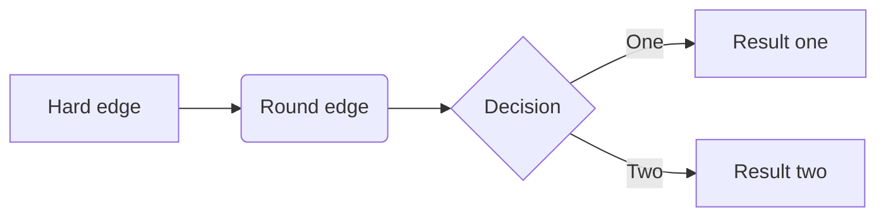

# Aprendizado de maquina
Aprendizado de maquina


- [Aprendizado de maquina](#aprendizado-de-maquina)
- [1. Definições](#1-definições)
- [Avisos, licença, observações, estatísticas](#avisos-licença-observações-estatísticas)
  - [Aviso](#aviso)
  - [Licença](#licença)
  - [Observação](#observação)
  - [Estatísticas](#estatísticas)


---
# 1. Definições

Aprendizado de máquina é uma área dentro da inteligência artificial. A primeira pessoa a cunhar o termo "machine learning" foi Arthur Samuel[^1] em 1959. O aprendizado de máquina construoi modelos de predição, aprendendo através de dados preexistente e prediz a saída de novos dados. A quantidade de entrada usada como entrada esta relacionado com a acurácia da predição de saída do modelo.

[^1]: Samuel, A. L. (1959). [Some studies in machine learning using the game of checkers](https://www.semanticscholar.org/paper/Some-Studies-in-Machine-Learning-Using-the-Game-of-Samuel/e9e6bb5f2a04ae30d8ecc9287f8b702eedd7b772?p2df). IBM Journal of research and development, 3(3), 210-229.





---
# Avisos, licença, observações, estatísticas


## Aviso
```
Este material esta recebendo atualizações frequentes. 
As informações aqui contidas podem ser alteradas sem aviso prévio.
```

## Licença
```
Attribution-NonCommercial-ShareAlike 4.0 International (CC BY-NC-SA 4.0) 
https://creativecommons.org/licenses/by-nc-sa/4.0/
```

## Observação
```
Primeira postagem em: Junho/2023.
```


## Estatísticas


Histórico de atualizações nos repositórios do Prof. Monteiro:<br>
[](https://github.com/monteiro74/tutorial_python)

[](https://git.io/streak-stats)

[](https://github.com/monteiro74/github-readme-stats)

Pulse:<br>
https://github.com/monteiro74/tutorial_python/pulse<BR>


Histórico de frequência de código:<BR>
https://github.com/monteiro74/tutorial_python/graphs/code-frequency<BR>

Atividade de commits:<BR>
https://github.com/monteiro74/tutorial_python/graphs/commit-activity<BR>

Trafego:<BR>
https://github.com/monteiro74/tutorial_python/graphs/traffic<BR>


[](https://github.com/monteiro74/github-readme-stats)

[](https://github.com/monteiro74/github-readme-stats)

[Voltar ao sumário](#sumário)<br>

